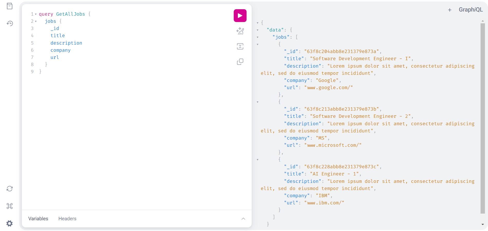

# GraphQL
This is an experiment project with GraphQL using Golang ang package [github.com/99designs/gqlgen](github.com/99designs/gqlgen)

GraphQL is an open-source data query and manipulation language for APIs that allows clients to request only the data they need in a predictable, efficient, and flexible manner. It reduces the number of round-trips between the client and server, improving performance, and reduces the amount of data transferred over the network.

Unlike traditional REST APIs where clients must make multiple requests to different endpoints to retrieve all the necessary data, GraphQL enables clients to request multiple resources in a single request, reducing the number of round-trips between the client and server, thus improving performance.

GraphQL also allows for a more efficient use of network resources by reducing the amount of data that needs to be transferred over the network. This is achieved by allowing clients to specify only the fields they need, eliminating the need for over-fetching or under-fetching of data.

GraphQL is widely used by many large organizations, including Facebook, GitHub, and Shopify, and has gained popularity among developers due to its flexibility and ease of use.

Example:


### Setup from scratch

1. Create a new folder for the Project
`mkdir gql-yt`
2. Mod init your project, give it whatever name you like
`go mod init github.com/akhil/gql-yt`
3. Get gql gen for your project
`go get github.com/99designs/gqlgen`
4. Add gqlgen to tools.go
`printf '// +build tools\npackage tools\nimport _ "github.com/99designs/gqlgen"' | gofmt > tools.go`
5. Get all the dependencies
`go mod tidy`
6. Initialize your project
`go run github.com/99designs/gqlgen init`
7. After you've written the graphql schema, run this - `go run github.com/99designs/gqlgen generate`
8. After you've built the project, these are the queries to interact with the API - 

### Usage

First run:
```bash
go run server.go
```

#### Get All Jobs

`query GetAllJobs{
  jobs{
    _id
    title
    description
    company
    url
  }
}`

=======================

#### Create Job

`mutation CreateJobListing($input: CreateJobListingInput!){
  createJobListing(input:$input){
    _id
    title
    description
    company
    url
  }
}`

`{
  "input": {
    "title": "Software Development Engineer - I",
    "description": "Lorem ipsum dolor sit amet, consectetur adipiscing elit, sed do eiusmod tempor incididunt",
    "company": "Google",
    "url": "www.google.com/"
  }
}`


=========================

#### Get Job By Id

`query GetJob($id: ID!){
job(id:$id){
_id
title
description
url
company
}
}`


`{
  "id": "638051d7acc418c13197fdf7"
}`


=========================


#### Update Job By Id

`mutation UpdateJob($id: ID!,$input: UpdateJobListingInput!) {
  updateJobListing(id:$id,input:$input){
    title
    description
    _id
    company
    url
  }
}`


`{
  "id": "638051d3acc418c13197fdf6",
  "input": {
    "title": "Software Development Engineer - III"
  }
}`

=================================


#### Delete Job By Id

`mutation DeleteQuery($id: ID!) {
  deleteJobListing(id:$id){
    deleteJobId
  }
}`

`{
  "id": "638051d3acc418c13197fdf6"
}`